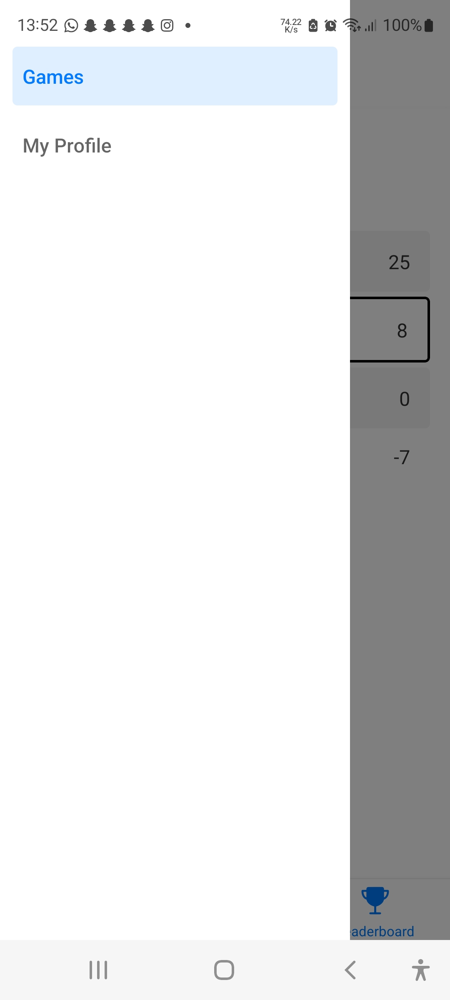

# RAMU Math App

Ovo je praktični projekt iz kolegija Razvoj Aplikacija za Mobilne Uređaje u
sklopu studija Računarstva na FSRE, SUM.

## Opis projekta

Projekt je rađen koristeći React Native framework za razvoj cross-platform
aplikacija, i koristio se Expo kao razvojna platforma.

Projekt za bazu podataka i autentikaciju koristi Firebase (Firebase Firestore i
Firebase Authentication).

Projekt se sastoji od sljedećih značajki:

- **Registracija** korisnika putem email-a i lozinke
- Registracija korisnika putem "**Sign in with Google**" - moguća podrška i
  drugih 3rd party identifikacijskih pružatelja (Facebook, Twitter, GitHub,
  Keycloak...)
- **Prijavljivanje** korisnika putem email-a i lozinke ili putem "Sign in with
  Google"
- **Kreiranje proizvoljnih korisničkih profila** (datum rođenja, ime, profilna
  slika\*)
- **Dodavanje "igara"** u bazu podataka ("igre" su zapravo strukture koje se
  sastoje od naziva, opisa, i slike\*) i ispis svih dodanih igara od svih
  korisnika
- **Igra Memorije** u kojoj se korisniku pokazuju brojevi jedan po jedan sa
  intervalom manjim od jedne sekunde, te on mora zapamtiti zbroj svih tih
  brojeva
- **Sustav ostvarivanja** (ili gubljenja) **bodova** prilikom točnog ili
  netočnog odgovora na Igri Memorije
- Pregled korisnikovog ukupnog broja bodova
- **Rang lista** svih korisnika, poredanih po broju bodova
- **Pregled korisnikovog vlastitog profila**, gdje njihov profil uključuje sve
  podatke koje su oni proizvoljno unjeli u trenutku kreiranja računa
- **Modifikacija korisnikovog profila**
- **Mogućnost brisanja računa**, gdje se vodi račun o tome je li korisnik
  registriran putem email-a i lozinke ili putem ID pružatelja, što je važno jer
  korisnik ne može izbrisati svoj račun dok ne potvrdi ponovno svoje sigurnosne
  podatke

Nedostatci:

- \* Firebase Storage nije više besplatan pa mogućnost uploadanja slika nije
  implementirana
- Nema mogućnosti resetiranja lozinke
- Primitivno rukovanje različitih pružatelja autentikacije (ako se korisnik
  registrira putem email+password, zatim se odjavi i onda ulogira putem Google-a
  sa istom email adresom, korisnik se više neće moći ulogirati koristeći
  email+password nego samo preko Google-a)
- Nestandardiziran dizajn i stilizacija komponenti

U projektu su osigurane i sljedeće **dodatne značajke**:

- Korektan ispis pogreški korisniku (putem biblioteke `burnt`)
- Korektno rukovanje različitih stanja komponenti, posebno onih vezanih za
  dohvat podataka i ostale asinhrone operacije (npr. ako je dugme u stanju
  učitavanja, ne možemo ga opet kliknuti da korisnik ne bi greškom više puta
  obavio istu operaciju)
- Robustan pristup navigaciji i zaštita privatnih ruta koristeći React Context i
  Provider-layout-redirection design pattern-a
- Kreiranje zasebnih komponenti za različite slučaje specifične za aplikaciju
  (npr. izbornik datuma)
- Tamna i svijetla tema, te komponente koje se integriraju sa sustavom teme
  (automatski se izabere točna boja pozadine i teksta ovisno o temi)
- Slojeviti navigacijski sustav sastavljen od stack-ova, tab-ova, i drawer-a
- `.prettierrc.json` i `.eslintrc.json` konfiguracija za korektno stiliziran i
  točan kod
- Korištenje Expo Dev Klijenta za mogućnost brze izrade nativnih modula
  aplikacije poput kamera, mikrofona, i slično

## Upute za pokretanje

**Preduvjeti**: Pošto ovaj projekt koristi Expo Dev Client, potrebno je imati
korektno konfiguriran Android SDK na računalu. To uključuje i instalaciju Java
JDK-a, Android SDK-a, i poželjno Android Studio IDE-a i Android Emulatora.

1. Preuzmite projekt s GitHub repozitorija
2. Otvorite terminal u direktoriju projekta
3. Pokrenite `npm install` kako bi se instalirali svi potrebni paketi
4. Pokrenite `npm run android` kako bi se pokrenuo Expo Dev Server i aplikacija
   kompajlirala za Android (ovo može potrajati nekoliko minuta)
5. Aplikacija će se automatski otvoriti na vašem uređaju ili emulatoru. Ukoliko
   se to ne dogodi, pritisnite slovo `a` u terminalu kako bi se aplikacija
   otvorila.

## Screenshots

### Authentication flow

  
  
  

### Main tabs layout

#### Games list

  
  

#### Memory game

  
  
  
  
  

#### Leaderboard

  

### Drawer layout

  

### Profile stack

#### Profile view

  
  

#### Edit Profile

  
  

#### Delete Profile/Account

	
	
	

